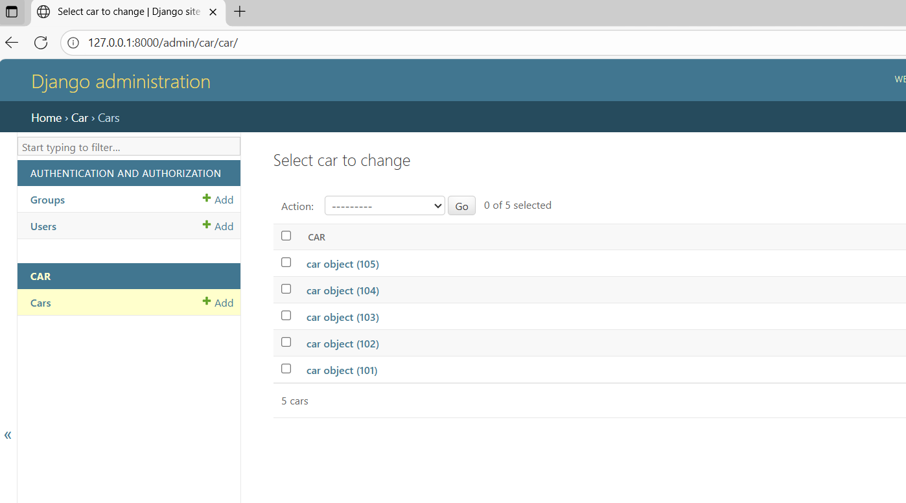

# Ex02 Django ORM Web Application
## Date: 
20-09-2025
## AIM
To develop a Django application to store and retrieve data from Car Inventory Database using Object Relational Mapping(ORM).

## ENTITY RELATIONSHIP DIAGRAM

## DESIGN STEPS

### STEP 1:
Clone the problem from GitHub

### STEP 2:
Create a new app in Django project

### STEP 3:
Enter the code for admin.py and models.py

### STEP 4:
Execute Django admin and create details for 10 books

## PROGRAM
## model.py program:
        from django.db import models
        class car(models.Model):
            car_id = models.IntegerField(primary_key=True)
            brand = models.CharField(max_length=20)
            model = models.CharField(max_length=20)
            year = models.DateField()
            price = models.IntegerField()

## admin.py program:
    from django.contrib import admin
    from . models import car

    admin.site.register(car)

    class carAdmin(admin.ModelAdmin):
        list_display = ('car_id','brand','model','year','price')

## OUTPUT

## RESULT
Thus the program for creating a database using ORM hass been executed successfully
